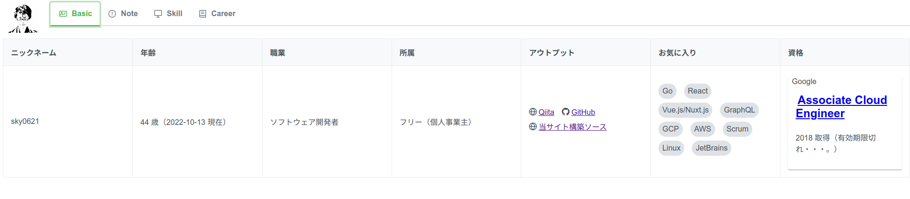
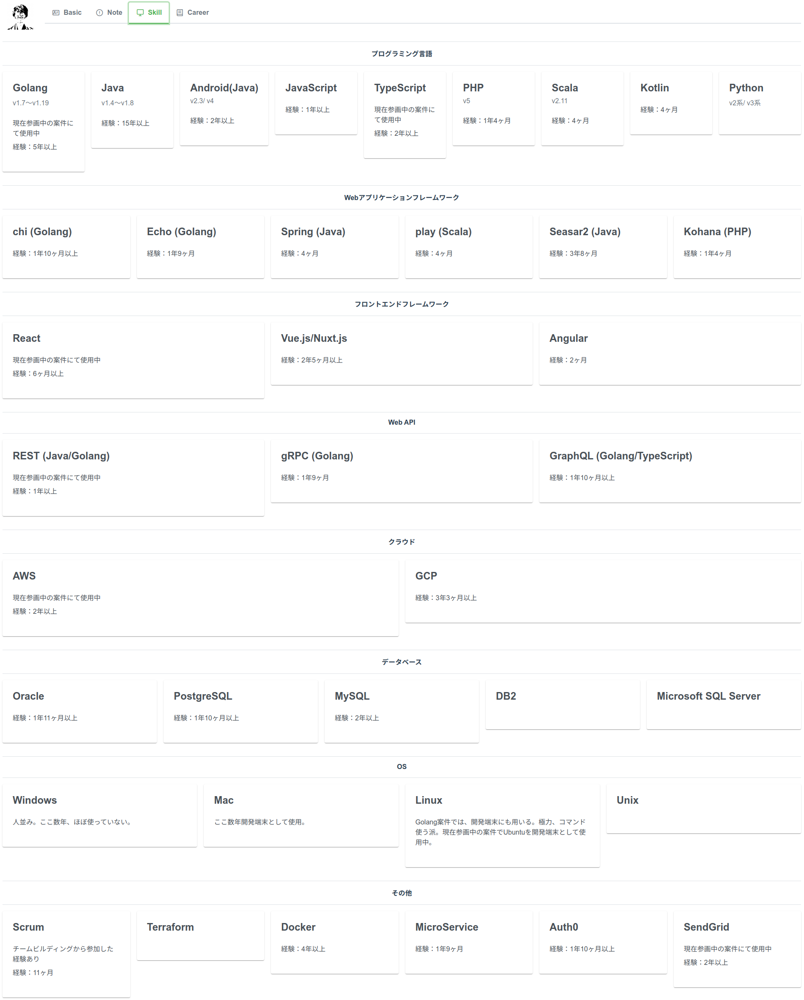
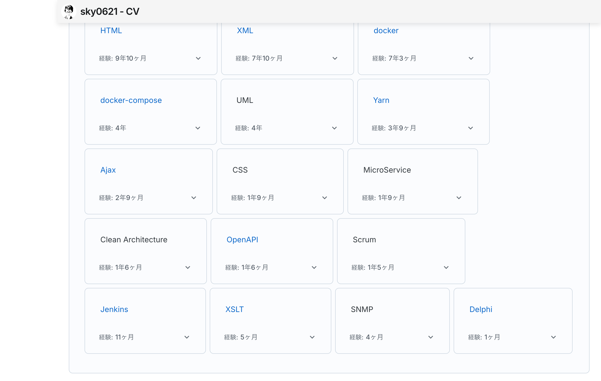
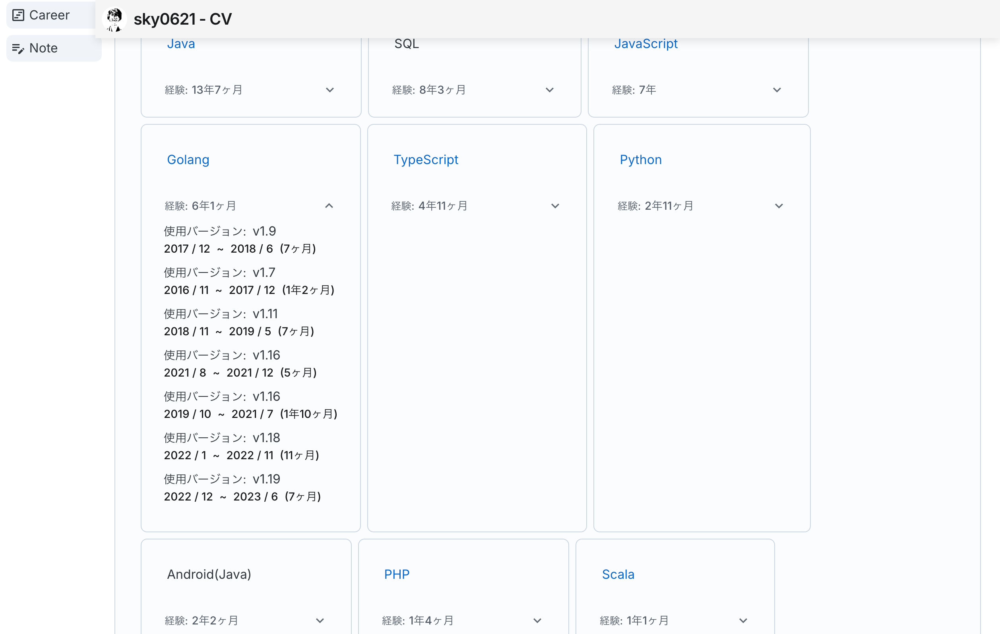
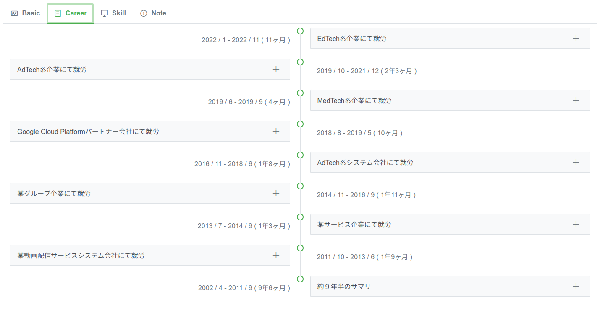
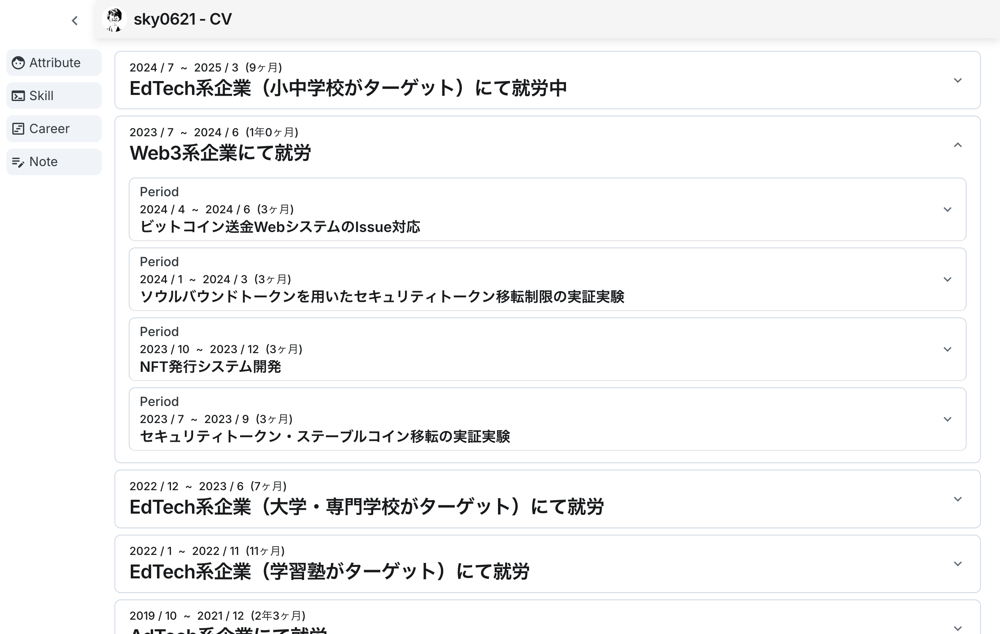
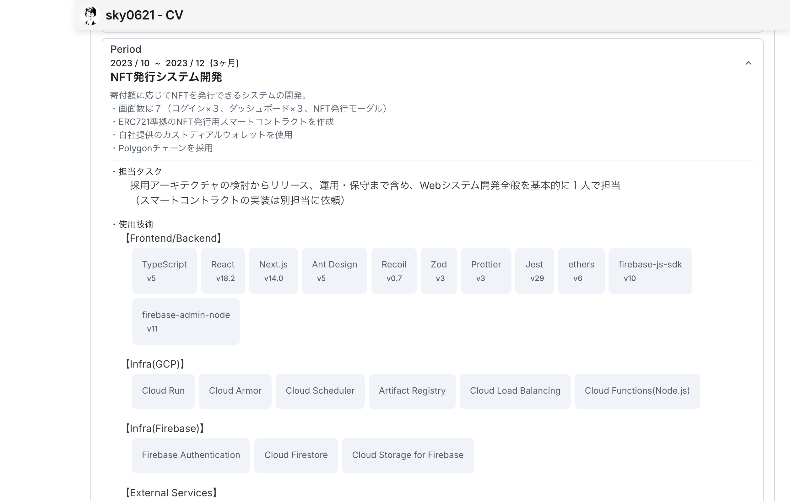
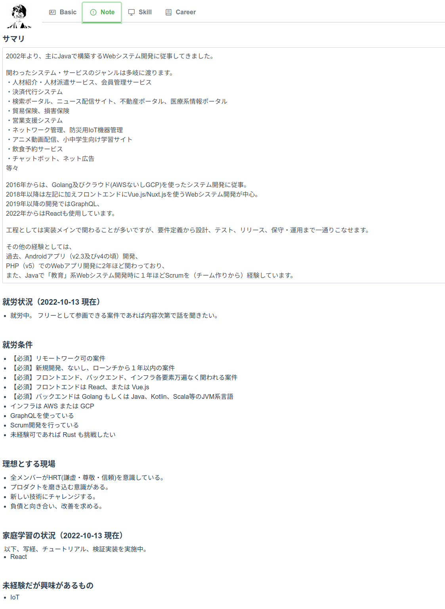

# cv

## description

Vercel上で公開している [Curriculum-Vitae](https://cv-lovat-theta-75.vercel.app/) のソース。

## relation

データソースは「[cv-admin](https://github.com/sky0621/cv-admin)」リポジトリで生成。

## screen shots

### Basic

### Skill

#### open

### Career

#### open

### Note

## directory structure

### app

GitHub Pages にて表示する経歴書のソース。

画面に表示する情報は Axios を介して取得する実装にしているがデータソースは [cv-admin](https://github.com/sky0621/cv-admin) 側で生成した JSON を読む形にしている。
