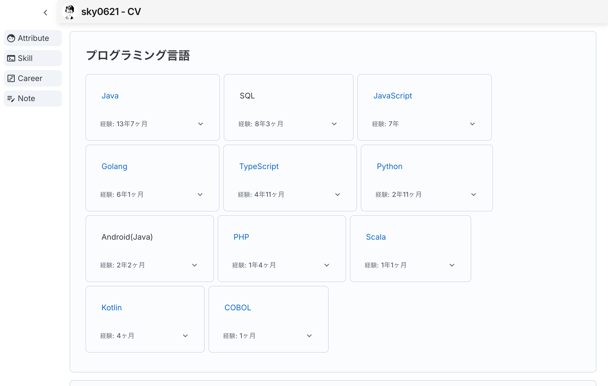
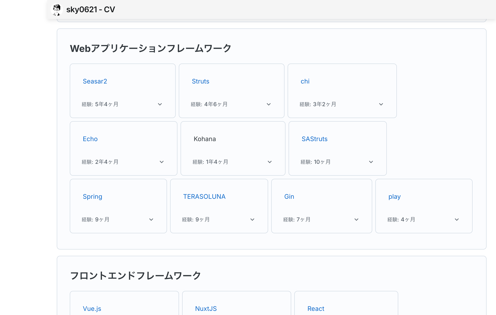
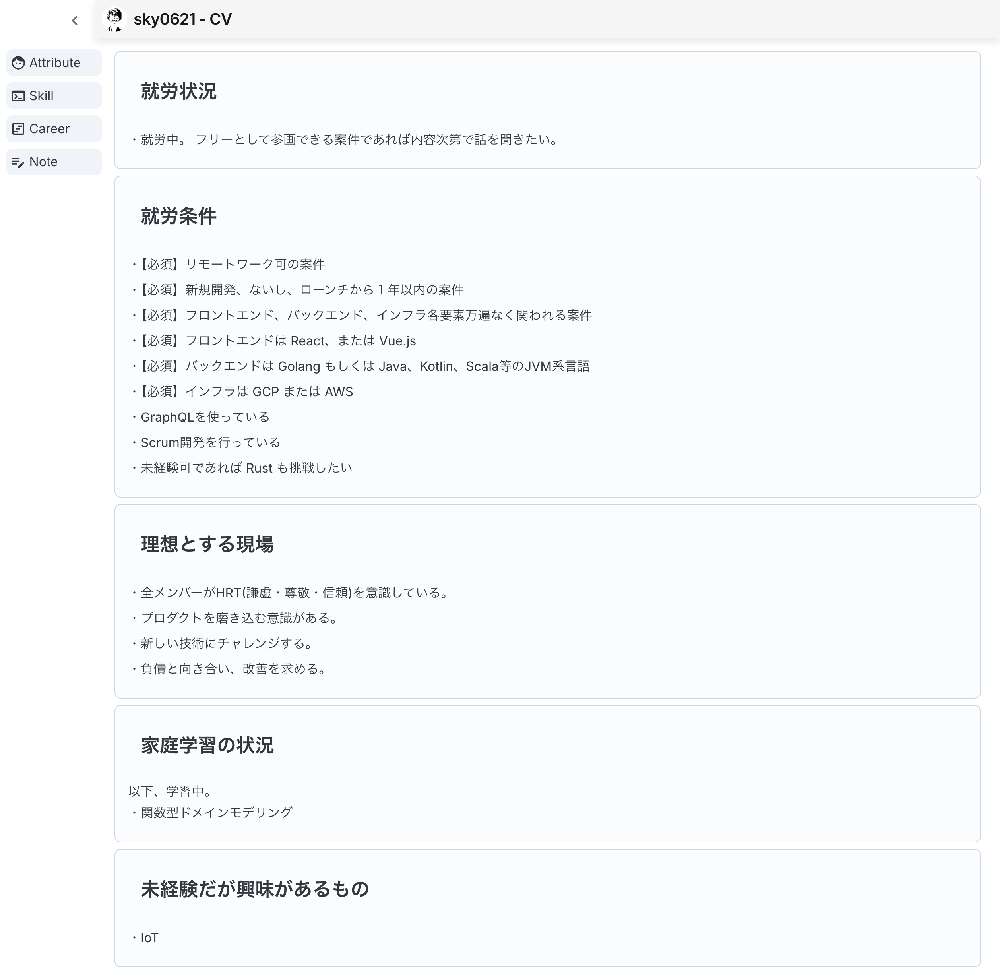

# cv

## description

GitHub Pages にて公開している [Curriculum-Vitae](https://sky0621.github.io/cv/) のソース。

## relation

データソースは「[cv-admin](https://github.com/sky0621/cv-admin)」リポジトリで生成。

## screen shots

### Basic

### Career

#### open

### Skill

#### open

### Note

## directory structure

### app

GitHub Pages にて表示する経歴書のソース。

画面に表示する情報は Axios を介して取得する実装にしているがデータソースは [cv-admin](https://github.com/sky0621/cv-admin) 側で生成した JSON を読む形にしている。

### docs

app の `yarn run build` によって、この配下に GitHub Pages でホストするSPAリソースが生成される。
