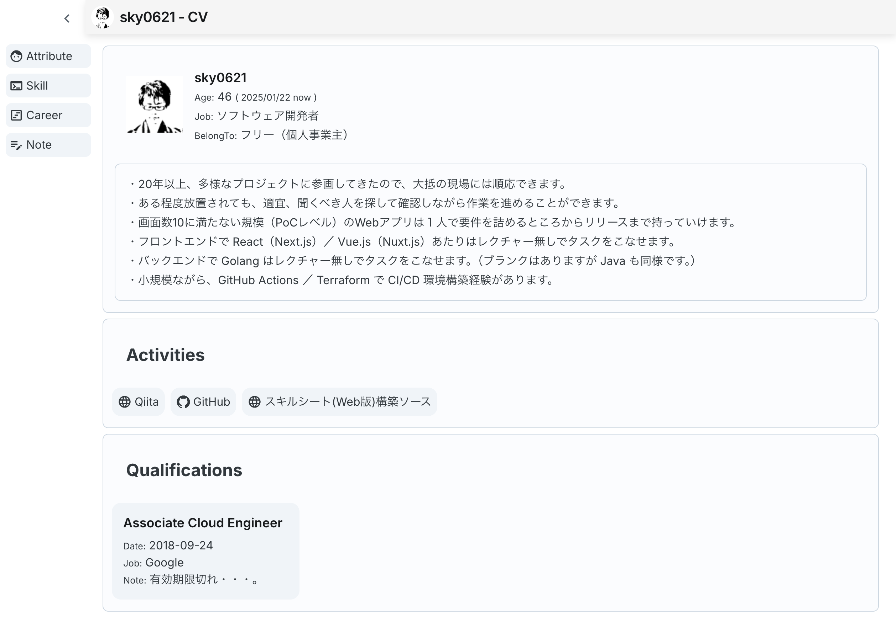
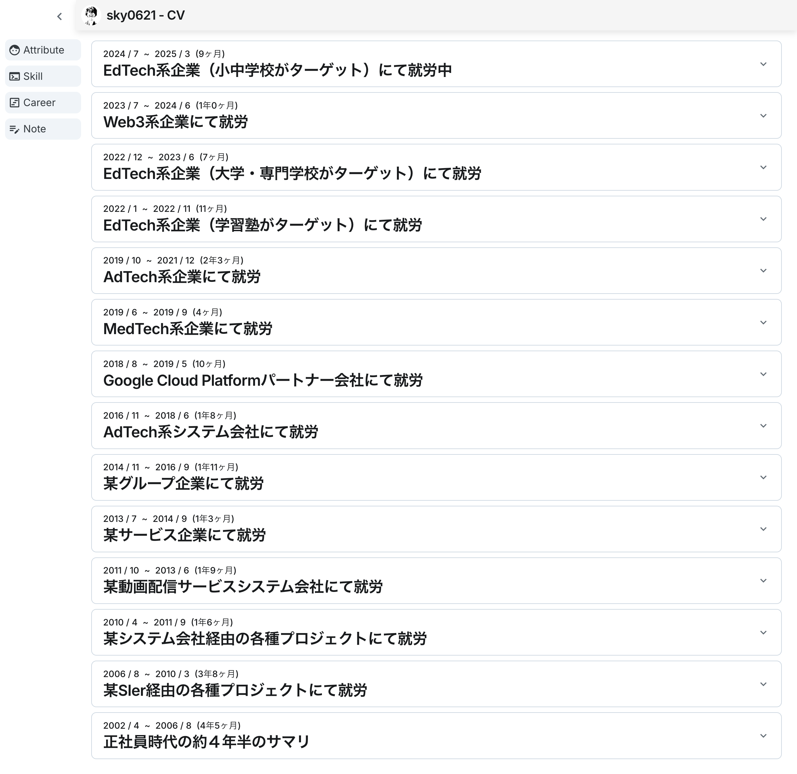

# cv

## description

[GitHub Pages にて公開している Curriculum-Vitae](https://sky0621.github.io/cv/) のソース。

## screen shots

### Basic

### Note

### Skill

### Career

#### open

## directory structure

### app

GitHub Pages にて表示する経歴書のソース。

画面に表示する情報は Axios を介して取得する実装にしているがデータソースは admin 側で生成した JSON を読む形にしている。

### admin/backend

app が利用する JSON の生成、及び、JSON 生成の元となる経歴書の情報を管理（永続先は SQLite ファイル）する。

各種情報のCRUD機能をAPIとして提供する。

今のところフロントエンドは作ってないので Postman で叩く。

### docs

app の `yarn run build` によって、この配下に GitHub Pages でホストするSPAリソースが生成される。

## todo

- データソースをRDB管理
- RDB -> ソースJSON生成
- リファクタ（主にコンポーネント分割）
